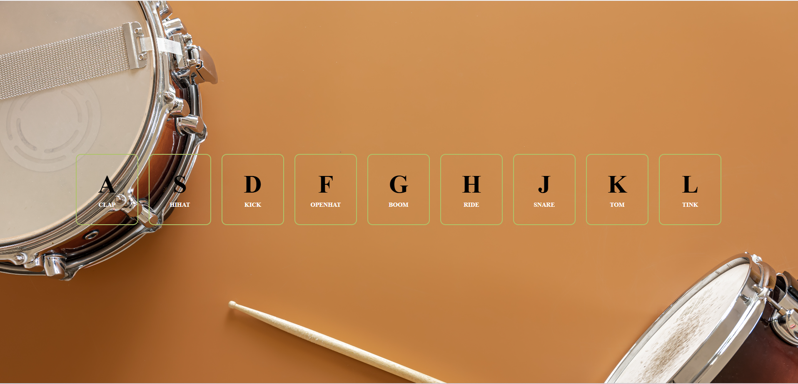

# 🥁 Drum Kit Web App

An interactive browser-based drum kit built using **HTML**, **CSS**, and **JavaScript**. This fun mini project lets you play a drum set using your keyboard, with live audio and visual feedback for each key press.

🎹 Press keys from **A to L** to play various sounds like CLAP, HIHAT, KICK, SNARE, and more!

---

## 🚀 Live Demo

👉 [**Try It Live**](https://greeshma-kenche.github.io/Drum-Kit-Web-App/)  

---

## 🎯 Features

- 🎧 9 different drum sounds (Clap, Hihat, Kick, Snare, etc.)
- ⚡ Keyboard-controlled sound triggers (A–L)
- ✨ Visual feedback with animated borders
- 🎨 Responsive background with clean layout
- 🧠 Simple, fast, and easy to extend

---

## 🛠️ Tech Stack & Skills Practiced

| Technology    | Role                                      |
|---------------|-------------------------------------------|
| **HTML5**     | Markup structure for keys and labels      |
| **CSS3**      | Styling layout, font, colors, animations  |
| **JavaScript**| Keyboard events, DOM manipulation, audio  |

### ✅ What I Learned

- DOM manipulation using `querySelector` and `addEventListener`
- Handling keyboard events (`keydown`)
- Playing audio dynamically using the `Audio` object
- Adding dynamic styles with JavaScript (`classList`)
- Responsive design and layout with Flexbox
- Project structuring and modular file organization
- Writing clean, readable, and maintainable code

---

## 📁 Project Structure

```
drum-kit/
│
├── assets/
│   ├── sounds/            # Drum sound files (.wav)
│   └── images/            
│
├── index.html             # Main HTML file
├── styles.css             # CSS styles and transitions
├── drum-kit.js            # JavaScript logic for audio and keys
└── README.md              # Project documentation
```

---

## 🧑‍💻 How to Run Locally

1. **Clone the repository**
   ```bash
   git clone https://github.com/greeshma-kenche/Drum-Kit-Web-App.git
   ```

2. **Navigate to the project folder**
   ```bash
   cd Drum-Kit-Web-App
   ```

3. **Open `index.html` in your browser**

4. **Start drumming using A–L keys! 🥁**

---

## 📸 Screenshot

  

---

## 🔮 Future Enhancements

- 🎙️ Record and playback user-created loops
- 🖱️ Mouse and touch click support
- 📱 Fully mobile responsive UI
- 🎛️ Volume and BPM control
- 💡 Beat visualizer with animations

---

## 💫 Feedback & Contribution

If you enjoyed this or found it helpful:
- ⭐ Star this repo
- 🍴 Fork it and make it your own
- 🧠 Share ideas or improvements

---

Let the rhythm guide your code! 🎶
